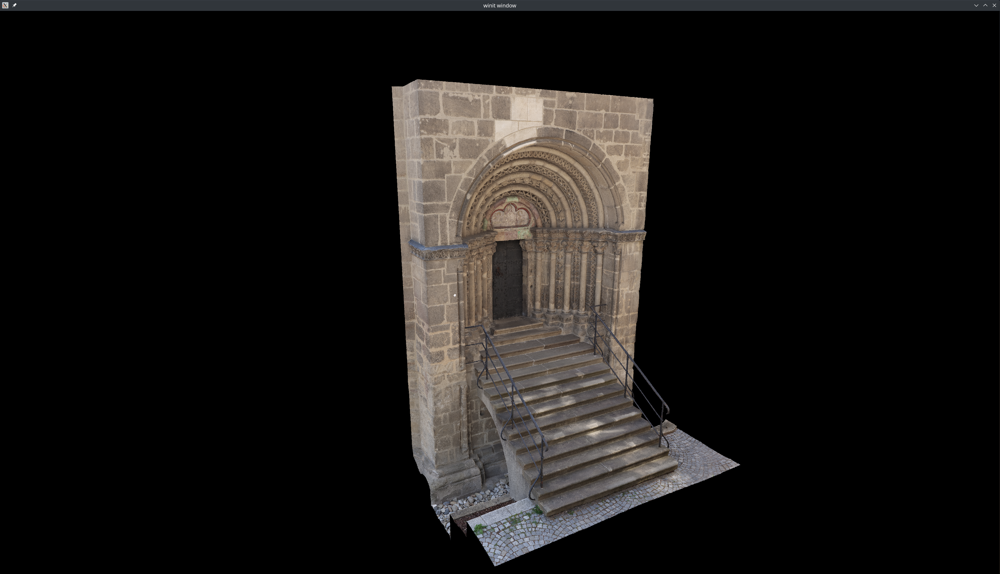

# Rusterizer
A rewrite of a software rasterizer I created as a part of a Computer graphics class at University of Hradec Králové.

# Build
Requires nightly compiler due to me using the handy `array_chunks` feature.

# Showcase

Model: https://sketchfab.com/3d-models/portal-c25f91a7fef046858b7d58166eca9343
